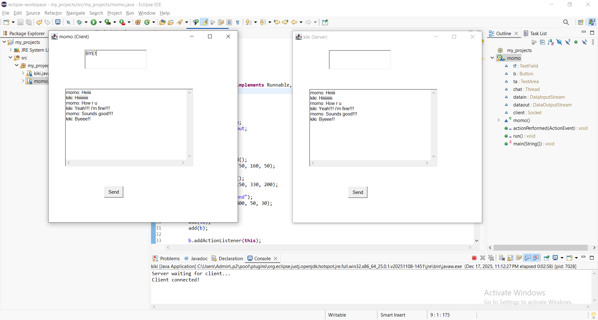

# Java AWT Chat Application  
### Client–Server Desktop Messaging System using Socket Programming

---

## 📌 Project Overview
This project is a *Java-based Client–Server Chat Application* developed using *Java AWT for GUI* and *TCP Socket Programming* for network communication.

The application demonstrates how two independent Java programs (Client and Server) establish a reliable connection over a network and exchange messages in real time using *input/output streams*.

This project focuses on *core Java concepts*, networking fundamentals, and desktop GUI development.

---

## 🏗️ System Architecture
The application follows a *Client–Server Architecture*:

- The *Server* listens on a specific port and waits for client connections.
- The *Client* initiates a socket connection to the server.
- Communication is established using *TCP/IP sockets*.
- Messages are exchanged using *DataInputStream* and *DataOutputStream*.

---

## 🧠 Technical Concepts Used
- Java Socket Programming  
- TCP/IP Communication  
- Client–Server Architecture  
- AWT GUI Components  
- Event Handling (ActionListener)  
- Blocking I/O Streams  
- Exception Handling  
- Package-based Project Structure  

---

## 📂 Project Structure

JavaAWTChatApplication/

  ├── src/

     │ └── chat/

          │ ├── Momo.java # Server-side implementation

          │ └── Kiki.java # Client-side implementation

  ├── chatoutput.png

  ├── README.md

---

## ⚙️ Technology Stack
| Layer | Technology |
|------|------------|
| Language | Java |
| GUI Framework | Java AWT |
| Networking | Java Sockets (TCP/IP) |
| Streams | DataInputStream, DataOutputStream |
| IDE | Eclipse |
| Version Control | Git & GitHub |

---

## ✨ Key Features
- Real-time bidirectional communication  
- GUI-based desktop application using AWT  
- Reliable TCP socket connection  
- Clear separation of client and server logic  
- Demonstrates low-level networking concepts in Java  

---

## ▶️ Execution Instructions
1. Import the project into *Eclipse IDE*
2. Run Momo.java to start the *Server*
3. Run Kiki.java to start the *Client*
4. Send and receive messages through the GUI

> ⚠️ The server must be started before the client to establish the connection successfully.

---

## 🖼️ Application Output

---

## 🔍 Learning Outcomes
- Practical understanding of socket-based communication  
- Experience with desktop GUI development  
- Hands-on implementation of client–server systems  
- Improved understanding of Java I/O streams  
- Strong foundation in Java networking concepts  

---

## 🚀 Scope for Enhancement
- Multi-client support using multithreading  
- Improved GUI using Swing or JavaFX  
- Message timestamps and chat history  
- Secure communication using encryption  
- File transfer functionality  

---

## 📬 Contact
📧 Email: keerthana28116@gmail.com  
🔗 LinkedIn: https://www.linkedin.com/in/keerthana-p-954242305  

---

⭐ If you find this repository useful, please consider starring it.
